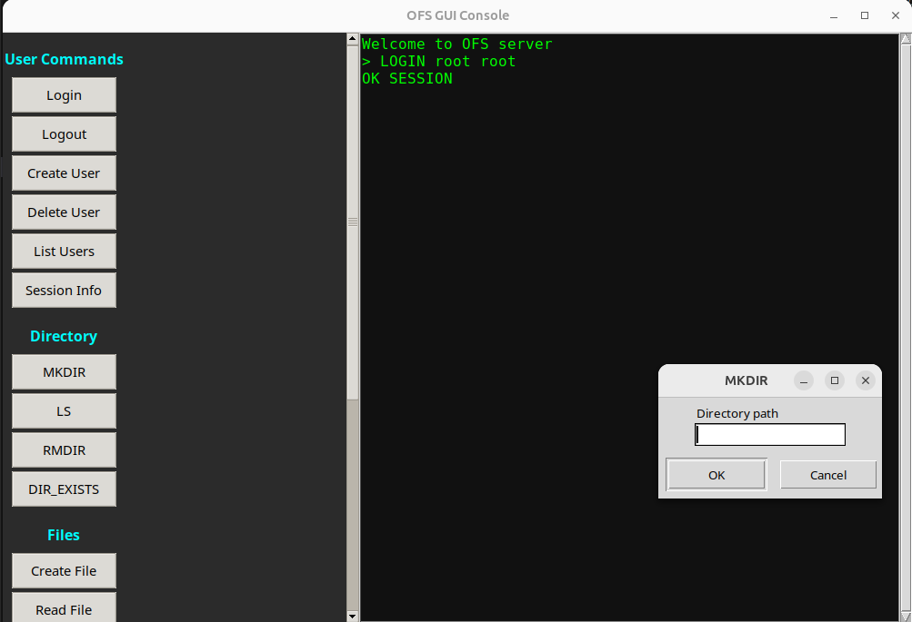

## 1 How to compile and run server

g++ -std=c++17 \
    source/server/server.cpp \
    source/src/fs_core.cpp \
    source/src/fs_user.cpp \
    source/src/fs_file.cpp \
    source/src/fs_dir.cpp \
    source/src/fs_info.cpp \
    source/src/dir_tree.cpp \
    source/src/path_index.cpp \
    source/src/free_bitmap.cpp \
    source/src/user_manager_hash.cpp \
    -I source/include \
    -o server_app -pthread

./server_app

## 2 UI:

Launch the UI:

python3 console_ui.py

Logging In

Before using any filesystem features, you must log in:
Click LOGIN in the left sidebar.
Enter your username and password in the fields on the right.
Click Submit.
The response will appear in the output panel at the bottom.

3. Running Commands

Every button in the sidebar opens a small form or input window on the right.
Examples:
Create Directory
Click MKDIR.
Enter directory path (e.g., /docs).
Press Submit.
Output shows success or error.

Create File
Click CREATE FILE.
Enter file path and type content in the multi-line editor.
Click Submit.

Read / Edit / Delete Files

All file operations work similarly — choose the action, fill the form, press submit.

4. Log Out and Exit

Click LOGOUT to end the session.
Click EXIT to close the UI.

